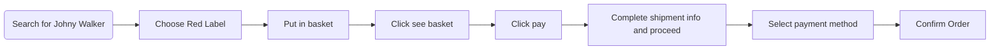
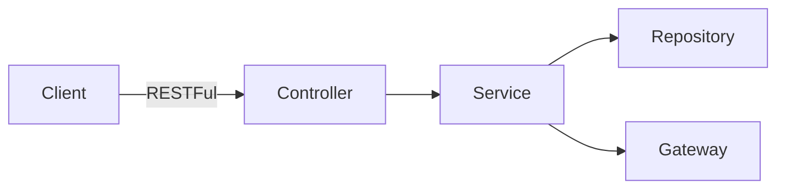

This Spring Boot project written in Java is a RESTFul API to serve data and execute business process transaction of a whisky store.
This API handle only success case as described here

## Scenario
https://github.com/aniwat0554/assignment-java-boot-camp/wiki/Scenario#user-stories

The process can be described as the flow shown below

## Design
### Success case process flow

### Conceptual Design
Which was modeled as shown in the following link
From users' perspective down to data modeling

https://github.com/aniwat0554/assignment-java-boot-camp/blob/main/ConceptualDesign.md

This API follow this architecture

### Architecture

API are designed as shown in the table below

### API Endpoints 
Method	Url	Description	Sample Valid Request Body	Sample Valid Response Body
#### Users Entity
| Method  | Url | Description | Sample Valid Request Body | Sample Valid Response Body |
| ------------- | ------------- | ------------- | ------------- | ------------- | 
| GET  | /users/{name}  | Get user's detail | - | [JSON](https://github.com/aniwat0554/assignment-java-boot-camp/blob/main/mock/usersmock) |
| GET  | /users  | Get all users info | - | [JSON](https://github.com/aniwat0554/assignment-java-boot-camp/blob/main/mock/allusersmock) |

#### Whiskies Entity
| Method  | Url | Description | Sample Valid Request Body | Sample Valid Response Body |
| ------------- | ------------- | ------------- | ------------- | ------------- | 
| GET  | /whiskies?name={name}  | Search whiskies by name | - | [JSON](https://github.com/aniwat0554/assignment-java-boot-camp/blob/main/mock/whiskiesproduct) |
| GET  | /whiskies/{name}  | Get a whisky detail | - | [JSON](https://github.com/aniwat0554/assignment-java-boot-camp/blob/main/mock/whiskyindividualresponse) |
