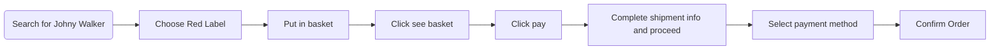
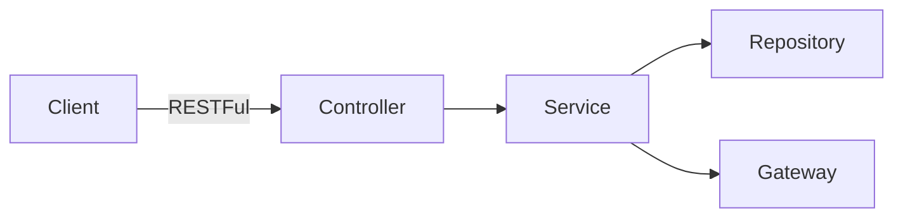

This Spring Boot project written in Java is a RESTFul API to serve data and execute business process transaction of a whisky store.
This API handle only success case as described here

## Scenario
https://github.com/aniwat0554/assignment-java-boot-camp/wiki/Scenario#user-stories

The process can be described as the flow shown below

## Design
### Success case process flow

### Conceptual Design
Which was modeled as shown in the following link
From users' perspective down to data modeling

https://github.com/aniwat0554/assignment-java-boot-camp/blob/main/ConceptualDesign.md

This API follow this architecture

### Architecture

API are designed as shown in the table below

### API Endpoints 
Method	Url	Description	Sample Valid Request Body	Sample Valid Response Body
#### Users Entity
| Method  | Url | Description | Sample Valid Request Body | Sample Valid Response Body |
| ------------- | ------------- | ------------- | ------------- | ------------- | 
| GET  | /users/{name}  | Get user's detail | - | [JSON](https://github.com/aniwat0554/assignment-java-boot-camp/blob/main/mock/usersmock) |
| GET  | /users  | Get all users info | - | [JSON](https://github.com/aniwat0554/assignment-java-boot-camp/blob/main/mock/allusersmock) |

#### Whiskies Entity
| Method  | Url | Description | Sample Valid Request Body | Sample Valid Response Body |
| ------------- | ------------- | ------------- | ------------- | ------------- | 
| GET  | /whiskies?name={name}  | Search whiskies by name | - | [JSON](https://github.com/aniwat0554/assignment-java-boot-camp/blob/main/mock/whiskiesproduct) |
| GET  | /whiskies/{name}  | Get a whisky detail | - | [JSON](https://github.com/aniwat0554/assignment-java-boot-camp/blob/main/mock/whiskyindividualresponse) |

#### Ordering Group
#### Basket Entity
| Method  | Url | Description | Sample Valid Request Body | Sample Valid Response Body |
| ------------- | ------------- | ------------- | ------------- | ------------- | 
| GET  | /ordering/basket/{name}  | Get basket of name | - | [JSON](https://github.com/aniwat0554/assignment-java-boot-camp/blob/main/mock/basket) |
| POST  | /ordering/basket/{name}/whisky  | Add whisky into the basket | [JSON - ID of whisky](https://github.com/aniwat0554/assignment-java-boot-camp/blob/main/mock/addtobasketrequest) | [JSON](https://github.com/aniwat0554/assignment-java-boot-camp/blob/main/mock/addwhiskytobasket) |

#### Order Entity
| Method  | Url | Description | Sample Valid Request Body | Sample Valid Response Body |
| ------------- | ------------- | ------------- | ------------- | ------------- | 
| POST  | /ordering/checkout  | Request checkout process | [JSON - name of shopper](https://github.com/aniwat0554/assignment-java-boot-camp/blob/main/mock/checkoutrequest) | [JSON](https://github.com/aniwat0554/assignment-java-boot-camp/blob/main/mock/checkoutresponse) |
| GET  | /ordering/order/{name}  | Get all orders of the shopper | - | [JSON](https://github.com/aniwat0554/assignment-java-boot-camp/blob/main/mock/orderlist) |
| GET  | /ordering/order/{name}/{id}  | Get an order | - | [JSON](https://github.com/aniwat0554/assignment-java-boot-camp/blob/main/mock/order) |
| PUT  | /ordering/order/{name}/{id}/Address  | Update address of order | [JSON](https://github.com/aniwat0554/assignment-java-boot-camp/blob/main/mock/addressputinorderrequest) | [JSON](https://github.com/aniwat0554/assignment-java-boot-camp/blob/main/mock/addressputinorderresponse) |
| POST  | /ordering/order/{name}/{id}/pay_on_delivery  | Request payment on delivery | - | [JSON](https://github.com/aniwat0554/assignment-java-boot-camp/blob/main/mock/deliverypaymentresp) |
| POST  | /ordering/order/{name}/{id}/pay_by_bank  | Request payment by bank | - | [JSON](https://github.com/aniwat0554/assignment-java-boot-camp/blob/main/mock/bankpaymentresponse) |
| POST  | /ordering/order/{name}/{id}/pay_by_credit_card  | Request payment by credit card | [JSON](https://github.com/aniwat0554/assignment-java-boot-camp/blob/main/mock/creditpaymentrequest) | [JSON](https://github.com/aniwat0554/assignment-java-boot-camp/blob/main/mock/creditpaymentresponse) |
| POST  | /ordering/payment/{transactionId}  | Callback from gateway to set status | [JSON - Payment status](https://github.com/aniwat0554/assignment-java-boot-camp/blob/main/mock/paymentstatusrequest) | [JSON](https://github.com/aniwat0554/assignment-java-boot-camp/blob/main/mock/paymentstatusresponse) |

