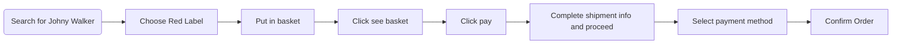
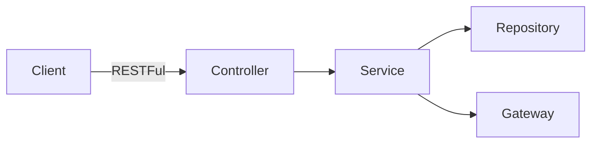

This Spring Boot project written in Java is a RESTFul API to serve data and execute business process transaction of a whisky store.
This API handle only success case as described here

https://github.com/aniwat0554/assignment-java-boot-camp/wiki/Scenario#user-stories

The process can be described as the flow shown below

## Design
### Success case process flow

Which was modeled as shown in the following link
From users' perspective down to data modeling

https://github.com/aniwat0554/assignment-java-boot-camp/blob/main/ConceptualDesign.md

This API follow this architecture

### Architecture

API are designed as shown in the table below

### API Endpoints 
